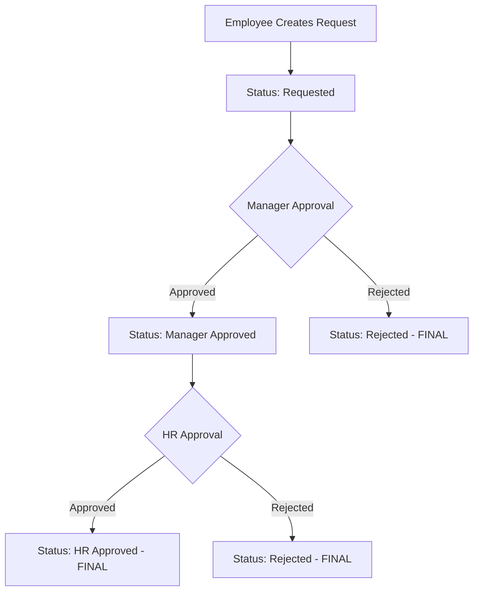

# Manager & HR Approval API Guide

## Overview

This comprehensive guide covers the Manager and HR approval workflow APIs in the SVG Mobile App. The system implements a **mandatory two-step approval process**: Manager approval first, then HR approval.

## Table of Contents

1. [API Endpoints](#api-endpoints)
2. [Authentication](#authentication)
3. [Workflow Overview](#workflow-overview)
4. [API Functions](#api-functions)
5. [Flutter Integration](#flutter-integration)
6. [Postman Testing](#postman-testing)
7. [Error Handling](#error-handling)
8. [Security & Permissions](#security--permissions)

## API Endpoints

### Base URL
```
https://your-domain.com/api/method/svg_mobile_app.api.
```

### Core Approval APIs
- `get_pending_requests` - Get requests pending approval
- `update_request_status` - Approve/reject requests
- `check_approval_screen_access` - Check user permissions
- `leave_shift_request` - Create new requests

## Authentication

All APIs require authentication using ERPNext session cookies or API keys.

### Headers Required
```http
Content-Type: application/json
Cookie: sid=your_session_id; system_user=yes
```

### API Key Authentication (Alternative)
```http
Authorization: token api_key:api_secret
```

## Workflow Overview

### Two-Step Approval Process



### Status Progression
1. **Requested** → Initial status when request is created
2. **Manager Approved** → After manager approval (intermediate)
3. **HR Approved** → Final approval (document submitted)
4. **Rejected** → Can happen at any level (final)

## API Functions

### 1. Get Pending Requests

Retrieves requests pending approval based on user role and hierarchy.

#### Endpoint
```
POST /api/method/svg_mobile_app.api.get_pending_requests
```

#### Parameters
```json
{
    "employee_id": "SVG-068",
    "from_date": "2025-01-01",
    "to_date": "2025-01-31",
    "pending_only": 1,
    "request_type": "shift request"
}
```

#### Parameter Details
- `employee_id` (required): Employee ID of the approver
- `from_date` (optional): Filter from date (YYYY-MM-DD)
- `to_date` (optional): Filter to date (YYYY-MM-DD)
- `pending_only` (optional): 1 for pending only, 0 for all (default: 1)
- `request_type` (optional): Filter by type ("leave application", "shift request", "overtime request")

#### Response
```json
{
    "status": "success",
    "data": [
        {
            "name": "HR-SHR-25-07-00011",
            "employee": "SVG-089",
            "employee_name": "Mostafa Amr Nazeer Mohamed",
            "from_date": "2025-01-15",
            "to_date": "2025-01-15",
            "request_type": "Work From Home",
            "status": "Requested",
            "reason": "Testing approval workflow",
            "creation": "2025-07-07 17:00:00",
            "doctype": "Shift Request"
        }
    ]
}
```

#### Filtering Logic
- **Managers**: See only requests from direct subordinates (`reports_to` field)
- **HR Users**: See requests from all company employees
- **Department Managers**: See requests from department members if no direct reports

### 2. Update Request Status

Approves or rejects requests following the two-step workflow.

#### Endpoint
```
POST /api/method/svg_mobile_app.api.update_request_status
```

#### Parameters
```json
{
    "employee_id": "SVG-068",
    "request_name": "HR-SHR-25-07-00011",
    "doctype": "Shift Request",
    "status": "approved",
    "reason": "Optional rejection reason"
}
```

#### Parameter Details
- `employee_id` (required): Employee ID of the approver
- `request_name` (required): Document name/ID of the request
- `doctype` (required): "Shift Request", "Leave Application", or "Overtime Request"
- `status` (required): "approved" or "rejected"
- `reason` (optional): Required for rejections, optional for approvals

#### Success Response
```json
{
    "status": "success",
    "message": "Request approved and forwarded to HR for final approval",
    "data": {
        "name": "HR-SHR-25-07-00011",
        "status": "Manager Approved"
    }
}
```

#### Error Response
```json
{
    "status": "fail",
    "message": "Only direct manager can approve this request at first level"
}
```

### 3. Check Approval Screen Access

Verifies if a user has permission to access the approval screen.

#### Endpoint
```
POST /api/method/svg_mobile_app.api.check_approval_screen_access
```

#### Parameters
```json
{
    "employee_id": "SVG-068"
}
```

#### Response
```json
{
    "status": "success",
    "has_access": true,
    "is_hr": false,
    "is_manager": true,
    "is_direct_manager": true,
    "has_reports": true
}
```

### 4. Create Request (For Testing)

Creates new requests for testing the approval workflow.

#### Endpoint
```
POST /api/method/svg_mobile_app.api.leave_shift_request
```

#### Parameters
```json
{
    "employee_id": "SVG-089",
    "type": "shift",
    "start_date": "2025-01-15",
    "end_date": "2025-01-15",
    "sub_type": "Work From Home",
    "reason": "Testing approval workflow"
}
```

#### Response
```json
{
    "status": "success",
    "message": "Shift request created successfully",
    "docname": "HR-SHR-25-07-00011"
}
```

## Flutter Integration

### 1. API Service Class

```dart
class ApprovalApiService {
  static const String baseUrl = 'https://your-domain.com/api/method/svg_mobile_app.api';
  
  // Get pending requests
  static Future<Map<String, dynamic>> getPendingRequests({
    required String employeeId,
    String? fromDate,
    String? toDate,
    int pendingOnly = 1,
    String? requestType,
  }) async {
    final response = await http.post(
      Uri.parse('$baseUrl.get_pending_requests'),
      headers: {
        'Content-Type': 'application/json',
        'Cookie': 'sid=${SessionManager.sessionId}; system_user=yes',
      },
      body: jsonEncode({
        'employee_id': employeeId,
        'from_date': fromDate,
        'to_date': toDate,
        'pending_only': pendingOnly,
        'request_type': requestType,
      }),
    );
    
    return jsonDecode(response.body);
  }
  
  // Update request status
  static Future<Map<String, dynamic>> updateRequestStatus({
    required String employeeId,
    required String requestName,
    required String doctype,
    required String status,
    String? reason,
  }) async {
    final response = await http.post(
      Uri.parse('$baseUrl.update_request_status'),
      headers: {
        'Content-Type': 'application/json',
        'Cookie': 'sid=${SessionManager.sessionId}; system_user=yes',
      },
      body: jsonEncode({
        'employee_id': employeeId,
        'request_name': requestName,
        'doctype': doctype,
        'status': status,
        'reason': reason,
      }),
    );
    
    return jsonDecode(response.body);
  }
  
  // Check approval access
  static Future<Map<String, dynamic>> checkApprovalAccess(String employeeId) async {
    final response = await http.post(
      Uri.parse('$baseUrl.check_approval_screen_access'),
      headers: {
        'Content-Type': 'application/json',
        'Cookie': 'sid=${SessionManager.sessionId}; system_user=yes',
      },
      body: jsonEncode({'employee_id': employeeId}),
    );
    
    return jsonDecode(response.body);
  }
}
```

### 2. Request Model

```dart
class PendingRequest {
  final String name;
  final String employee;
  final String employeeName;
  final String fromDate;
  final String toDate;
  final String requestType;
  final String status;
  final String reason;
  final String creation;
  final String doctype;
  
  PendingRequest({
    required this.name,
    required this.employee,
    required this.employeeName,
    required this.fromDate,
    required this.toDate,
    required this.requestType,
    required this.status,
    required this.reason,
    required this.creation,
    required this.doctype,
  });
  
  factory PendingRequest.fromJson(Map<String, dynamic> json) {
    return PendingRequest(
      name: json['name'] ?? '',
      employee: json['employee'] ?? '',
      employeeName: json['employee_name'] ?? '',
      fromDate: json['from_date'] ?? '',
      toDate: json['to_date'] ?? '',
      requestType: json['request_type'] ?? '',
      status: json['status'] ?? '',
      reason: json['reason'] ?? '',
      creation: json['creation'] ?? '',
      doctype: json['doctype'] ?? '',
    );
  }
}
```

### 3. Approval Screen Widget

```dart
class ApprovalScreen extends StatefulWidget {
  final String employeeId;

  const ApprovalScreen({Key? key, required this.employeeId}) : super(key: key);

  @override
  _ApprovalScreenState createState() => _ApprovalScreenState();
}

class _ApprovalScreenState extends State<ApprovalScreen> {
  List<PendingRequest> pendingRequests = [];
  bool isLoading = true;
  bool hasAccess = false;

  @override
  void initState() {
    super.initState();
    checkAccessAndLoadRequests();
  }

  Future<void> checkAccessAndLoadRequests() async {
    try {
      // Check if user has approval access
      final accessResult = await ApprovalApiService.checkApprovalAccess(widget.employeeId);

      if (accessResult['status'] == 'success' && accessResult['has_access'] == true) {
        setState(() {
          hasAccess = true;
        });

        // Load pending requests
        await loadPendingRequests();
      } else {
        setState(() {
          hasAccess = false;
          isLoading = false;
        });
      }
    } catch (e) {
      print('Error checking access: $e');
      setState(() {
        isLoading = false;
      });
    }
  }

  Future<void> loadPendingRequests() async {
    try {
      final result = await ApprovalApiService.getPendingRequests(
        employeeId: widget.employeeId,
        pendingOnly: 1,
      );

      if (result['status'] == 'success') {
        setState(() {
          pendingRequests = (result['data'] as List)
              .map((json) => PendingRequest.fromJson(json))
              .toList();
          isLoading = false;
        });
      }
    } catch (e) {
      print('Error loading requests: $e');
      setState(() {
        isLoading = false;
      });
    }
  }

  Future<void> handleApproval(PendingRequest request, String action) async {
    try {
      final result = await ApprovalApiService.updateRequestStatus(
        employeeId: widget.employeeId,
        requestName: request.name,
        doctype: request.doctype,
        status: action,
      );

      if (result['status'] == 'success') {
        ScaffoldMessenger.of(context).showSnackBar(
          SnackBar(content: Text(result['message'])),
        );

        // Reload requests
        await loadPendingRequests();
      } else {
        ScaffoldMessenger.of(context).showSnackBar(
          SnackBar(content: Text(result['message']), backgroundColor: Colors.red),
        );
      }
    } catch (e) {
      ScaffoldMessenger.of(context).showSnackBar(
        SnackBar(content: Text('Error: $e'), backgroundColor: Colors.red),
      );
    }
  }

  @override
  Widget build(BuildContext context) {
    if (isLoading) {
      return Scaffold(
        appBar: AppBar(title: Text('Pending Approvals')),
        body: Center(child: CircularProgressIndicator()),
      );
    }

    if (!hasAccess) {
      return Scaffold(
        appBar: AppBar(title: Text('Pending Approvals')),
        body: Center(
          child: Text('You don\'t have permission to access this screen'),
        ),
      );
    }

    return Scaffold(
      appBar: AppBar(title: Text('Pending Approvals (${pendingRequests.length})')),
      body: RefreshIndicator(
        onRefresh: loadPendingRequests,
        child: ListView.builder(
          itemCount: pendingRequests.length,
          itemBuilder: (context, index) {
            final request = pendingRequests[index];
            return Card(
              margin: EdgeInsets.all(8),
              child: ListTile(
                title: Text('${request.employeeName}'),
                subtitle: Column(
                  crossAxisAlignment: CrossAxisAlignment.start,
                  children: [
                    Text('${request.doctype}: ${request.requestType}'),
                    Text('${request.fromDate} to ${request.toDate}'),
                    Text('Status: ${request.status}'),
                    Text('Reason: ${request.reason}'),
                  ],
                ),
                trailing: Row(
                  mainAxisSize: MainAxisSize.min,
                  children: [
                    IconButton(
                      icon: Icon(Icons.check, color: Colors.green),
                      onPressed: () => handleApproval(request, 'approved'),
                    ),
                    IconButton(
                      icon: Icon(Icons.close, color: Colors.red),
                      onPressed: () => handleApproval(request, 'rejected'),
                    ),
                  ],
                ),
              ),
            );
          },
        ),
      ),
    );
  }
}
```

## Postman Testing

### 1. Environment Setup

Create a Postman environment with these variables:

```json
{
  "base_url": "https://your-domain.com",
  "session_id": "your_session_id_here",
  "employee_id": "SVG-068",
  "test_employee_id": "SVG-089"
}
```

### 2. Authentication Setup

#### Pre-request Script (Add to Collection)
```javascript
// Set authentication headers
pm.request.headers.add({
    key: 'Content-Type',
    value: 'application/json'
});

pm.request.headers.add({
    key: 'Cookie',
    value: `sid=${pm.environment.get('session_id')}; system_user=yes`
});
```

### 3. Test Collection

#### Test 1: Check Approval Access
```http
POST {{base_url}}/api/method/svg_mobile_app.api.check_approval_screen_access
Content-Type: application/json

{
    "employee_id": "{{employee_id}}"
}
```

**Expected Response:**
```json
{
    "status": "success",
    "has_access": true,
    "is_hr": false,
    "is_manager": true,
    "is_direct_manager": true,
    "has_reports": true
}
```

#### Test 2: Get Pending Requests
```http
POST {{base_url}}/api/method/svg_mobile_app.api.get_pending_requests
Content-Type: application/json

{
    "employee_id": "{{employee_id}}",
    "pending_only": 1
}
```

**Expected Response:**
```json
{
    "status": "success",
    "data": [
        {
            "name": "HR-SHR-25-07-00011",
            "employee": "SVG-089",
            "employee_name": "Mostafa Amr Nazeer Mohamed",
            "from_date": "2025-01-15",
            "to_date": "2025-01-15",
            "request_type": "Work From Home",
            "status": "Requested",
            "reason": "Testing approval workflow",
            "creation": "2025-07-07 17:00:00",
            "doctype": "Shift Request"
        }
    ]
}
```

#### Test 3: Create Test Request
```http
POST {{base_url}}/api/method/svg_mobile_app.api.leave_shift_request
Content-Type: application/json

{
    "employee_id": "{{test_employee_id}}",
    "type": "shift",
    "start_date": "2025-01-20",
    "end_date": "2025-01-20",
    "sub_type": "Work From Home",
    "reason": "Postman testing"
}
```

**Expected Response:**
```json
{
    "status": "success",
    "message": "Shift request created successfully",
    "docname": "HR-SHR-25-07-00013"
}
```

#### Test 4: Manager Approval (First Step)
```http
POST {{base_url}}/api/method/svg_mobile_app.api.update_request_status
Content-Type: application/json

{
    "employee_id": "{{employee_id}}",
    "request_name": "HR-SHR-25-07-00013",
    "doctype": "Shift Request",
    "status": "approved"
}
```

**Expected Response:**
```json
{
    "status": "success",
    "message": "Request approved and forwarded to HR for final approval",
    "data": {
        "name": "HR-SHR-25-07-00013",
        "status": "Manager Approved"
    }
}
```

#### Test 5: HR Approval (Second Step)
```http
POST {{base_url}}/api/method/svg_mobile_app.api.update_request_status
Content-Type: application/json

{
    "employee_id": "SVG-091",
    "request_name": "HR-SHR-25-07-00013",
    "doctype": "Shift Request",
    "status": "approved"
}
```

**Expected Response:**
```json
{
    "status": "success",
    "message": "Shift request approved",
    "data": {
        "name": "HR-SHR-25-07-00013",
        "status": "HR Approved"
    }
}
```

#### Test 6: HR Bypass Attempt (Should Fail)
```http
POST {{base_url}}/api/method/svg_mobile_app.api.update_request_status
Content-Type: application/json

{
    "employee_id": "SVG-091",
    "request_name": "HR-SHR-25-07-00014",
    "doctype": "Shift Request",
    "status": "approved"
}
```

**Expected Response:**
```json
{
    "status": "fail",
    "message": "Only direct manager can approve this request at first level"
}
```

#### Test 7: Request Rejection
```http
POST {{base_url}}/api/method/svg_mobile_app.api.update_request_status
Content-Type: application/json

{
    "employee_id": "{{employee_id}}",
    "request_name": "HR-SHR-25-07-00015",
    "doctype": "Shift Request",
    "status": "rejected",
    "reason": "Insufficient justification"
}
```

**Expected Response:**
```json
{
    "status": "success",
    "message": "Shift request rejected",
    "data": {
        "name": "HR-SHR-25-07-00015",
        "status": "Rejected"
    }
}
```

### 4. Postman Test Scripts

#### Test Script for Approval Workflow
```javascript
pm.test("Status is success", function () {
    var jsonData = pm.response.json();
    pm.expect(jsonData.status).to.eql("success");
});

pm.test("Response has required fields", function () {
    var jsonData = pm.response.json();
    pm.expect(jsonData).to.have.property("data");
    pm.expect(jsonData.data).to.have.property("name");
    pm.expect(jsonData.data).to.have.property("status");
});

pm.test("Status progression is correct", function () {
    var jsonData = pm.response.json();
    var validStatuses = ["Manager Approved", "HR Approved", "Rejected"];
    pm.expect(validStatuses).to.include(jsonData.data.status);
});

// Store request name for next test
if (pm.response.json().status === "success") {
    pm.environment.set("last_request_name", pm.response.json().data.name);
}
```

## Error Handling

### Common Error Responses

#### 1. Permission Denied
```json
{
    "status": "fail",
    "message": "You don't have permission to update this request"
}
```

#### 2. Invalid Workflow Step
```json
{
    "status": "fail",
    "message": "Only direct manager can approve this request at first level"
}
```

#### 3. Document Not Found
```json
{
    "status": "fail",
    "message": "Shift Request HR-SHR-25-07-00999 not found"
}
```

#### 4. Invalid Status
```json
{
    "status": "fail",
    "message": "Invalid status"
}
```

### Flutter Error Handling

```dart
Future<void> handleApiCall() async {
  try {
    final result = await ApprovalApiService.updateRequestStatus(
      employeeId: employeeId,
      requestName: requestName,
      doctype: doctype,
      status: status,
    );

    if (result['status'] == 'success') {
      // Handle success
      showSuccessMessage(result['message']);
    } else {
      // Handle API error
      showErrorMessage(result['message']);
    }
  } on SocketException {
    showErrorMessage('No internet connection');
  } on TimeoutException {
    showErrorMessage('Request timeout');
  } on FormatException {
    showErrorMessage('Invalid response format');
  } catch (e) {
    showErrorMessage('Unexpected error: $e');
  }
}
```

## Security & Permissions

### Role-Based Access Control

#### Manager Permissions
- Can approve/reject requests from direct subordinates only
- Cannot see requests from other departments/managers
- Cannot bypass HR approval for final submission

#### HR Permissions
- Can approve/reject requests from company employees
- Cannot bypass manager approval (must be second step)
- Can see all company requests but not system-wide

#### Employee Permissions
- Can only create requests
- Cannot access approval screens
- Cannot approve their own requests

### Data Filtering

#### Backend Filtering (Implemented)
- Managers see only subordinates' requests (`reports_to` field)
- HR sees only company employees' requests
- No system-wide access for any role

#### Security Measures
- Session-based authentication required
- Role validation on every API call
- Employee hierarchy respected
- Audit trail maintained

### Best Practices

1. **Always validate permissions** before showing approval screens
2. **Handle errors gracefully** with user-friendly messages
3. **Implement proper loading states** during API calls
4. **Cache approval access** to avoid repeated API calls
5. **Refresh data** after approval actions
6. **Log approval actions** for audit purposes

## Testing Checklist

### Functional Testing
- [ ] Manager can see only subordinate requests
- [ ] HR can see only company requests
- [ ] Two-step approval workflow enforced
- [ ] HR cannot bypass manager approval
- [ ] Rejection workflow works at any level
- [ ] Status progression is correct
- [ ] Audit trail is maintained

### Security Testing
- [ ] Unauthorized users cannot access approval APIs
- [ ] Cross-manager request access is blocked
- [ ] Invalid employee IDs are rejected
- [ ] Session validation works correctly
- [ ] Role-based filtering is enforced

### Performance Testing
- [ ] API response times are acceptable
- [ ] Large request lists load efficiently
- [ ] Filtering is done at database level
- [ ] Pagination works for large datasets

### Integration Testing
- [ ] Flutter app integrates correctly
- [ ] Postman tests pass consistently
- [ ] Error handling works as expected
- [ ] Real-world scenarios work properly

## Troubleshooting

### Common Issues

#### 1. "No permission" errors
- Check user roles and employee hierarchy
- Verify session authentication
- Ensure employee has `reports_to` relationships

#### 2. Empty request lists
- Verify employee has subordinates
- Check company assignments
- Ensure requests exist in correct status

#### 3. Approval workflow errors
- Verify request status before approval
- Check user roles and permissions
- Ensure proper employee hierarchy

#### 4. API authentication failures
- Verify session ID is valid
- Check cookie format and headers
- Ensure user has proper roles

### Debug Commands

```python
# Check employee hierarchy
frappe.get_all("Employee", filters={"reports_to": "SVG-068"}, pluck="name")

# Check user roles
frappe.get_roles("user@example.com")

# Check request status
frappe.get_doc("Shift Request", "HR-SHR-25-07-00011").status

# Test API function directly
from svg_mobile_app.api import get_pending_requests
get_pending_requests("SVG-068", pending_only=1)
```

---

## Conclusion

This API provides a robust, secure, and scalable solution for manager and HR approval workflows. The two-step approval process ensures proper oversight while maintaining data security through role-based access control and backend filtering.

### Key Features
- **Mandatory Two-Step Approval**: Manager → HR workflow enforced
- **Role-Based Access Control**: Proper permission management
- **Backend Filtering**: Secure data access based on employee hierarchy
- **Comprehensive Error Handling**: User-friendly error messages
- **Audit Trail**: Complete tracking of approval actions
- **Flutter Integration**: Ready-to-use code examples
- **Postman Testing**: Complete test suite for validation

### API Endpoints Summary
1. `get_pending_requests` - Retrieve filtered pending requests
2. `update_request_status` - Process approvals/rejections
3. `check_approval_screen_access` - Validate user permissions
4. `leave_shift_request` - Create test requests

### Security Highlights
- Managers see only subordinate requests
- HR sees only company employee requests
- No system-wide access for any role
- Session-based authentication required
- Employee hierarchy respected

### Testing Coverage
- Functional workflow testing
- Security permission testing
- Performance optimization testing
- Integration testing with Flutter
- Postman API testing suite

For additional support or questions, please refer to the ERPNext documentation or contact the development team.

**Last Updated:** July 7, 2025
**Version:** 1.0
**Author:** SVG Mobile App Development Team
