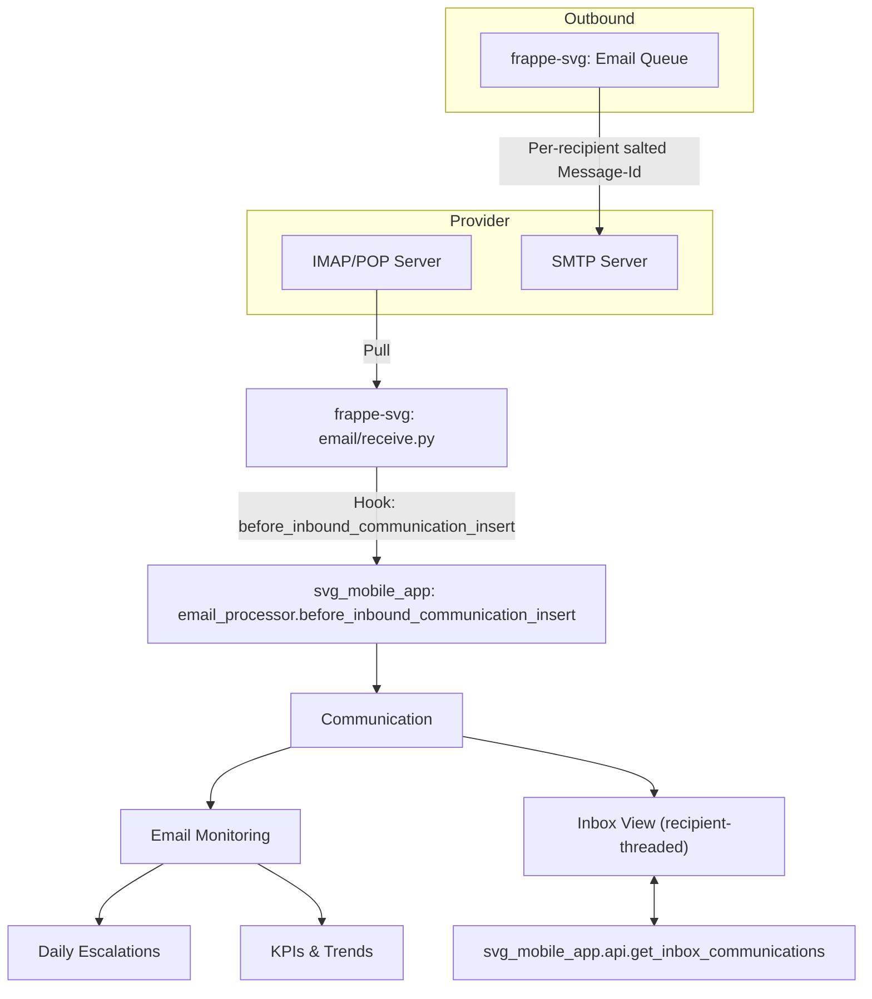
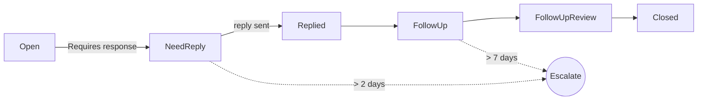
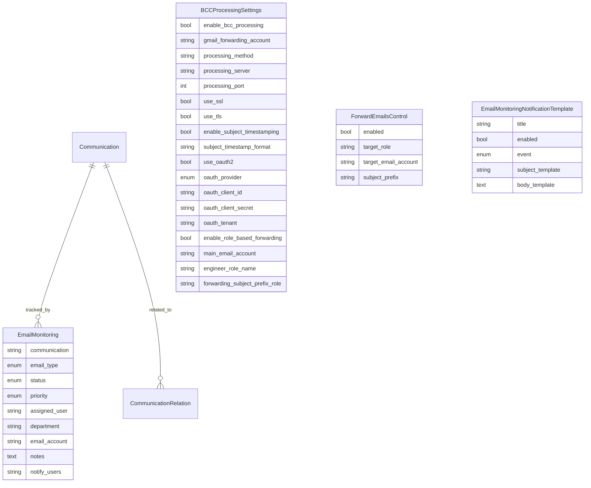

# Email System Implementation Guide (SVG)

This guide documents the complete email system implemented across the custom app (`svg_mobile_app`) and the forks (`frappe-svg`, `erpnext-svg`). It covers features, architecture, configuration, testing, and operations.

## Goals
- Treat each recipient (TO/CC/BCC) as a distinct email for tracking and workflows
- Preserve full content and attachments across clones/forwards
- Provide monitoring, escalations, notifications, and reporting
- Support provider-agnostic forwarding with optional OAuth2
- Maintain backward compatibility in core via feature flags and hooks

---

## High-level Architecture



---

## Feature Matrix

- Recipient-aware threading: inbound and outbound
- Per-recipient cloning for TO/CC/BCC (attachments preserved)
- Optional subject timestamping
- Role-based forwarding (mapping via Forward Emails Control)
- Provider-agnostic forwarding (override SMTP or OAuth2-capable Email Account)
- Email Monitoring (auto-create, statuses, priorities, assignment)
- Escalations (Need Reply >2d, Follow Up >7d)
- Notification templates and multi-recipient notifications
- Inbox recipient-threading toggle with API-backed fetch and client grouping
- Monitoring Dashboard (bulk actions)
- Reports: KPIs and Trends

---

## Repositories and Key Files

- Framework adjustments (frappe-svg):
  - `frappe/email/receive.py`: recipient-aware Message-Id salting & pre-insert hook
  - `frappe/email/doctype/email_queue/email_queue.py`: outbound per-recipient Message-Id salting
  - `frappe/public/js/frappe/views/inbox/inbox_view.js`: toggle, sorting, grouping, custom fetch
  - `frappe/email/email.md`: updated docs

- Custom app (svg_mobile_app):
  - Engine & hooks: `email_genius/email_processor.py`, `hooks.py`
  - APIs: `api.py`
  - Doctypes: see Section “Doctypes”
  - Dashboard: `svg_mobile_app/page/email_monitoring_dashboard/`
  - Reports: `svg_mobile_app/report/email_account_kpis/`, `svg_mobile_app/report/email_account_trends/`

---

## Configuration

### Site Config Flag
- `email_recipient_salt_for_threading`: enable recipient-aware Message-Id salting

Example `site_config.json`:
```json
{
  "email_recipient_salt_for_threading": 1
}
```

### Hooks (already wired)
- `Communication.before_insert`: `svg_mobile_app.email_genius.email_processor.process_bcc_email`
- `Communication.after_insert`:
  - `svg_mobile_app.email_genius.email_processor.process_role_based_forwarding`
  - `svg_mobile_app.svg_mobile_app.doctype.email_monitoring.email_monitoring_hooks.create_email_monitoring_record`
- Scheduler daily: `svg_mobile_app.svg_mobile_app.doctype.email_monitoring.email_monitoring_escalation.run_escalations`

### Doctypes

- **BCC Processing Settings** (`svg_mobile_app/.../bcc_processing_settings/`)
  - Core fields: `enable_bcc_processing`, `gmail_forwarding_account`, `processing_method`, `processing_server`, `processing_port`, `use_ssl`, `use_tls`, `enable_subject_timestamping`, `subject_timestamp_format`
  - Role forwarding: `enable_role_based_forwarding`, `main_email_account`, `engineer_role_name`, `forwarding_subject_prefix_role`
  - OAuth2: `use_oauth2`, `oauth_provider` (Microsoft 365/Gmail), `oauth_client_id`, `oauth_client_secret`, `oauth_tenant`

- **Forward Emails Control**
  - `target_role`, `target_email_account`, `subject_prefix`, `enabled`

- **Email Monitoring**
  - `communication`, `email_type (Issued/Incoming)`, `status`, `priority`, `assigned_user`, `department`, `email_account`, `notes`, `notify_users`

- **Communication Relation**
  - `communication`, `related_communication`, `relation_type`, `notes`

- **Email Monitoring Notification Template**
  - `title`, `enabled`, `event (assignment/status_change/escalation)`, `subject_template`, `body_template`

---

## Inbound Processing

```mermaid
sequenceDiagram
  participant S as "IMAP/POP Server"
  participant R as "frappe-svg receive.py"
  participant H as "svg_mobile_app hook"
  participant C as "Communication"
  participant M as "Email Monitoring"

  S->>R: New email
  R->>R: Derive salted Message-Id (optional flag)
  R->>H: before_inbound_communication_insert(data, mail)
  H->>H: Map X-Frappe headers; timestamp subject (opt); normalize cc/bcc
  H->>C: Insert Communication
  C->>M: Auto-create Email Monitoring (after_insert)
```

- Salting logic derives a stable per-recipient suffix based on original id and headers
- Notification visibility preserved via `X-Frappe-Original-Message-ID`, `X-Frappe-Recipient-Type`, `X-Frappe-Recipient-Index`

## Outbound Queue (Per-Recipient)

- In `email_queue.py`, prior to send, the Message-Id is salted per recipient when the flag is set
- `X-Frappe-Original-Message-ID` is attached; headers include recipient context

---

## Inbox: Recipient-Threaded View

- Toggle via toolbar button (persisted as route option)
- When enabled:
  - Inbox fetches via `svg_mobile_app.api.get_inbox_communications(email_account, recipient_threading=1)`
  - Sorts by `message_id` first
  - Client-side grouping collapses duplicate `message_id` rows into a single thread item

---

## Monitoring Workflow

### Statuses
- Open → Need Reply → Replied → Follow Up → Follow Up Review → Closed

### Dashboard Page
- Path: `email-monitoring-dashboard`
- Filters: Status, Type, Email Account, Assigned User, Priority
- Bulk Actions: Assign, Change Status, Change Priority

### Escalations
- Daily job:
  - Need Reply older than 2 days → email assigned user
  - Follow Up older than 7 days → email assigned user



### Notifications
- `update_email_monitoring` emails assigned user and any `notify_users` provided
- If a template for the event is found (`Email Monitoring Notification Template`), subject/body are rendered

---

## Reports & Analytics

- **Email Account KPIs** (`Email Account KPIs`)
  - Per-account counts of Open/Need Reply/Replied/Follow Up
  - Average response time (basic approximation)

- **Email Account Trends** (`Email Account Trends`)
  - Daily counts by status over the last 30 days (optionally filtered by account)

---

## Provider Abstraction & OAuth2

### Options
- Forward via:
  - OAuth2-capable Email Account (preferred when `use_oauth2` is enabled)
  - SMTP override (`processing_server`, `processing_port`, SSL/TLS flags)
  - Fallback to standard `frappe.sendmail`

### OAuth2 Flow
- Configure fields in BCC Processing Settings:
  - `use_oauth2 = 1`
  - `oauth_provider` (Microsoft 365 or Gmail)
  - `oauth_client_id`, `oauth_client_secret`, `oauth_tenant` (for M365)
- Ensure an appropriate `Email Account` is authorized and referenced by `main_email_account` when forwarding with OAuth2

---

## APIs

- `svg_mobile_app.api.get_inbox_communications(email_account, recipient_threading=0, limit_start=0, limit_page_length=50)`
- `svg_mobile_app.api.get_email_monitoring(filters, limit_start, limit_page_length, order_by)`
- `svg_mobile_app.api.get_monitoring_by_communication(communication)`
- `svg_mobile_app.api.update_email_monitoring(name, status, assigned_user, priority)`
- `svg_mobile_app.api.link_communications(comm_name, related_comm_name, relation_type, notes)`
- `svg_mobile_app.api.get_related_communications(comm_name)`

---

## Deployment & Setup

1) Pull and build all apps
- Update repos (`frappe-svg`, `erpnext-svg`, `svg_mobile_app`)
- `bench build && bench migrate`
- Ensure scheduler is enabled

2) Site configuration
- Set `email_recipient_salt_for_threading: 1` in `site_config.json` (optional)

3) Email Accounts
- Create and authorize incoming/outgoing accounts (IMAP/POP, SMTP or OAuth2)

4) App configuration
- BCC Processing Settings: enable processing, forwarding preferences, OAuth2/provider settings
- Forward Emails Control: map roles to Email Accounts

5) Permissions
- System Manager can manage new doctypes, reports, and pages

---

## Testing

### Automated Tests
- Outbound per-recipient salting
- Inbound E2E: multi-recipient create → monitoring record → inbox API returns grouped result
- Escalation job executes without error

### Manual Test Plan
1) Inbound threading
- Send email to multiple recipients (To/CC/BCC)
- Verify distinct `Communication` records exist (post-processing)
- Confirm `Email Monitoring` created for each

2) Inbox view
- Toggle recipient-threading on Inbox
- Confirm grouping by salted `message_id` and ordered correctly

3) Monitoring dashboard
- Filter by account and status
- Select multiple rows and apply bulk Assign/Status/Priority
- Verify `update_email_monitoring` triggers notifications (with templates if configured)

4) Escalations
- Set a record to Need Reply and backdate `modified` >2 days
- Trigger escalation job (daily) and verify notification

5) Provider paths
- With OAuth2 enabled: forwarding uses the configured OAuth2 Email Account
- With SMTP override set: forwarding uses provided host/port/SSL/TLS

---

## Troubleshooting
- No threads separation: ensure `email_recipient_salt_for_threading` is enabled and Inbox toggle is on
- Missing monitoring entries: verify `after_insert` hook is wired and no permissions block insert
- No notifications: ensure templates have `enabled=1` and email queue is running
- OAuth2 send fails: confirm OAuth client, secrets, and Email Account authorization

---

## Security & Compliance
- Avoid storing sensitive headers in templates or logs
- Respect privacy for BCC recreation (BCC headers are not visible inbound; per-recipient cloning handles this)
- Use OAuth2 where possible for provider-auth best practices

---

## Change Control
- All framework changes gated by flags/hooks for safe upstreaming
- App-side features are additive; disabling flags restores legacy behavior

---

## Appendix: Data Model Overview



---

## Appendix: Status/Notification Templates
- Example subject: `Email Monitoring {event}: {communication}`
- Example body:
  - `Communication: {communication}`
  - `Status: {status}`
  - `Priority: {priority}`
  - `Account: {email_account}`

Variables are formatted via Python `str.format`.

---

## Appendix: API Examples (Python)

```python
frappe.call('svg_mobile_app.api.get_inbox_communications', {
  'email_account': 'All Accounts',
  'recipient_threading': 1,
  'limit_start': 0,
  'limit_page_length': 50,
})

frappe.call('svg_mobile_app.api.update_email_monitoring', {
  'name': 'EM-0001',
  'status': 'Need Reply',
  'assigned_user': 'user@example.com',
  'priority': 'High',
})
```

---

## Revision History
- Initial implementation as per Emails Proposed Technical Solution (recipient-aware threading, monitoring, dashboards, reports, notifications, OAuth2-capable forwarding)

