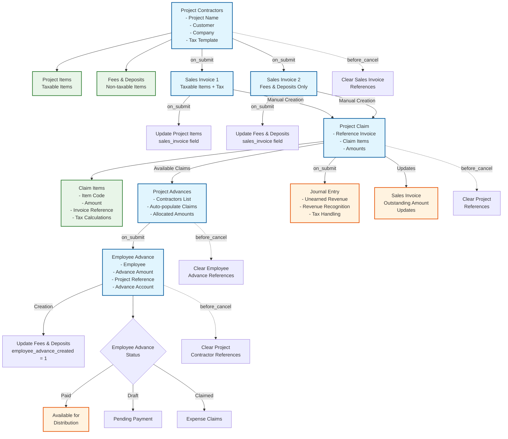

# SVG Mobile App - Complete Business Workflow Diagram

## Overview
This document contains the complete business workflow diagram and analysis for the SVG Mobile App project management system, showing the relationships between Project Contractors, Sales Invoice, Project Claim, Project Advances, and Employee Advance doctypes.

## Workflow Diagram

## Complete Business Workflow Analysis

### **PHASE 1: PROJECT SETUP & AUTOMATIC INVOICING**

1. **Project Contractors** serves as the master document containing:
   - **Project Items** (child table): Taxable items linked to "Orbit Engineering Items"
   - **Fees & Deposits** (child table): Non-taxable items linked to "Project Fees item"
   - Tax Template for applying taxes to project items only
   - Customer, Company, and project details

2. **Automatic Sales Invoice Creation** (triggered on Project Contractors submit):
   - Creates **TWO separate Sales Invoices**:
     - **Invoice 1**: Project Items with Tax Template applied (taxable)
     - **Invoice 2**: Fees & Deposits only (non-taxable)
   - Uses `sales_invoice_hooks.py` to update child table references
   - Links back via `custom_for_project` field

### **PHASE 2: CLAIMING & REVENUE RECOGNITION**

3. **Project Claim** (manual creation by users):
   - References one or multiple Sales Invoices via `invoice_references`
   - Creates **Claim Items** child table with:
     - Item codes, amounts, ratios
     - Tax calculations and account mappings
     - Invoice and Project Contractor references
   - **Automatically creates Journal Entries** for revenue recognition
   - Updates Sales Invoice outstanding amounts
   - Validates claim amounts against invoice balances

### **PHASE 3: ADVANCE DISTRIBUTION SYSTEM**

4. **Project Advances** (distribution management):
   - **Auto-populates Project Claim references** for selected contractors
   - Uses **Project Advance Contractors** child table to track:
     - Available balances per contractor
     - Allocated amounts
     - Project Claim references
   - Validates advance amounts against available claim balances
   - Calculates totals and tracks status

5. **Employee Advance Creation** (automatic on Project Advances submit):
   - **Automatically creates individual Employee Advances** for each allocation
   - Sets up proper advance accounts and currency handling
   - Links back to Project Contractors via `project_contractors_reference`
   - Updates Fees & Deposits `employee_advance_created` tracking field
   - Handles exchange rates and company-specific accounts

### **KEY RELATIONSHIPS & DATA FLOW**

- **Project Contractors → Sales Invoice** (1:2 relationship - taxable/non-taxable split)
- **Sales Invoice → Project Claim** (M:M via `invoice_references` field)
- **Project Claim → Project Advances** (1:M via auto-populated claim references)
- **Project Advances → Employee Advance** (1:M automatic creation on submit)
- **Employee Advance → Project Contractors** (circular reference with cleanup)

### **CIRCULAR REFERENCE PREVENTION SYSTEM**

All doctypes implement comprehensive cleanup hooks:
- `before_cancel_hook()`, `on_trash_hook()`, `after_delete_hook()`
- Clear cross-references before deletion/cancellation
- Handle submitted document cancellation before cleanup
- Prevent deletion failures due to circular dependencies

### **BUSINESS LOGIC HIGHLIGHTS**

1. **Automatic Tax Handling**: Only Project Items get taxed, Fees & Deposits remain tax-free
2. **Revenue Recognition**: Project Claims create proper accounting entries
3. **Balance Validation**: System prevents over-allocation at every level
4. **Status Tracking**: Each phase updates status fields for workflow visibility
5. **Multi-Currency Support**: Handles exchange rates and company currencies
6. **Employee Advance Distribution**: Sophisticated dialog system for manual employee selection and amount distribution

## Technical Implementation Details

### Child Table Structures

#### Project Items
- **Fields**: item, rate, invoiced, addition_date, sales_invoice
- **Filter**: Item Group = "Orbit Engineering Items"
- **Purpose**: Taxable project work items

#### Fees and Deposits
- **Fields**: item, rate, sales_invoice
- **Filter**: Item Group = "Project Fees item"
- **Purpose**: Non-taxable fees and deposits

#### Claim Items
- **Fields**: item, amount, ratio, current_balance, tax_rate, tax_amount, unearned_account, revenue_account, invoice_reference, project_contractor_reference
- **Purpose**: Track claimed amounts and accounting details

#### Project Advance Contractors
- **Fields**: project_contractor, project_claim_reference, project_name, customer, total_available_balance, allocated_amount, notes
- **Purpose**: Track advance allocations per contractor

### Key Methods and Hooks

#### Project Contractors
- `on_submit()`: Creates automatic sales invoices
- `create_taxable_sales_invoice()`: Creates invoice with tax template
- `create_non_taxable_sales_invoice()`: Creates fees invoice without tax
- `check_paid_employee_advance_availability()`: Checks for paid advances
- `create_employee_advances()`: Creates employee advances from dialog

#### Project Claim
- `on_submit()`: Creates journal entries and updates invoice outstanding
- `create_journal_entry()`: Handles revenue recognition accounting
- `update_invoice_outstanding_amounts()`: Updates sales invoice balances
- `validate_claim_amount()`: Prevents over-claiming

#### Project Advances
- `on_submit()`: Creates employee advances automatically
- `auto_populate_project_claim_references()`: Links available claims
- `create_employee_advances()`: Generates individual employee advances
- `validate_advance_amount()`: Ensures amounts don't exceed available balances

#### Employee Advance (Custom)
- Cleanup hooks for circular reference prevention
- Links to Project Contractors via `project_contractors_reference`
- Integration with company advance accounts

This workflow represents a complete project financial management system from initial setup through employee advance distribution, with proper accounting integration and comprehensive error prevention mechanisms. 